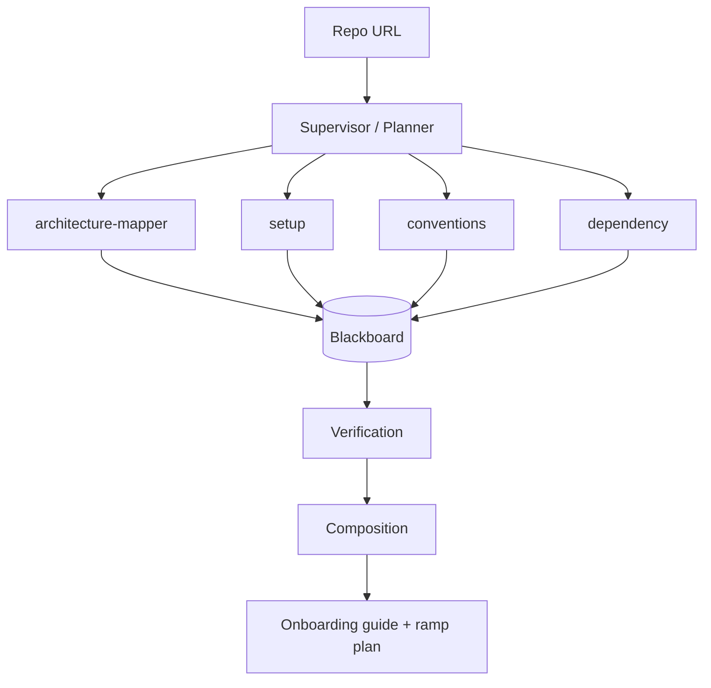
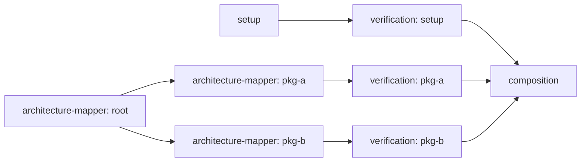
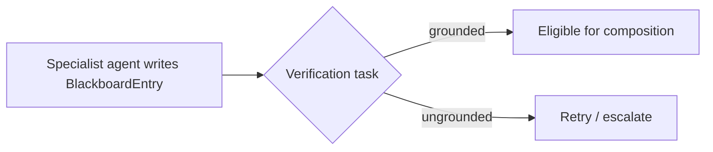

# Architecture

This document describes the intended design of the onboarding-workforce system:
a multi-agent pipeline that reads a GitHub repo and produces a verified onboarding
guide + ramp plan. **This is the design for the full system.** Step 1 (this repo,
as committed) is scaffold and data model only — no orchestrator, no agent
implementations beyond a no-op echo stub, no LLM calls. Everything below describes
where step 2+ will land, so the schema and interfaces committed now don't need to
change shape later.

## Topology: supervisor/planner → parallel specialists

The planner decomposes a run into a task DAG and dispatches ready tasks to
specialist agents. Four specialists cover distinct concerns that don't need to
know about each other:

- **architecture-mapper** — module boundaries, entry points, how components talk.
- **setup** — how to get the repo running locally (install, env vars, run/test commands).
- **conventions** — style, testing patterns, review norms, naming conventions.
- **dependency** — third-party libraries, internal package graph, version constraints.

These run in parallel because they read disjoint (or loosely overlapping) slices
of the repo and don't produce a shared narrative until composition. Forcing them
into a single sequential pass would only slow the run down for no accuracy gain.

## Why a task DAG, not a fixed pipeline

A fixed pipeline (mapper → setup → conventions → dependency → done) assumes every
repo needs the same steps in the same order. Real repos don't cooperate:

- A monorepo needs the architecture-mapper to run per-package, fanning out into
  N mapping tasks discovered only after the first pass inspects the tree.
- A repo with no automated setup (no Docker, no lockfile) may need the setup
  agent to spawn a follow-up investigation task instead of terminating.
- Verification failures on one blackboard entry shouldn't block composition of
  entries that passed — they should re-queue just that task.

A DAG models this directly: tasks carry `depends_on` edges to other tasks, so a
task only becomes eligible once its dependencies complete, and new tasks can be
inserted at runtime (a mapper task discovering sub-packages adds child mapper
tasks; a failed verification adds a retry task depending on nothing but pointing
at the same blackboard key). A fixed pipeline can't express "add a step to
this run based on what an earlier step found" without becoming a DAG anyway —
so we model it as one from the start rather than retrofitting it under pressure
in step 3.

The DAG lives as edges on `Task` rows (`depends_on: list[task_id]`), not as a
separate edges/adjacency table. A run's task set is small (tens, not millions),
so there's no query-performance reason to normalize edges out, and keeping them
on the row means "is this task ready" is a single row-level check (all ids in
`depends_on` have status `completed`) instead of a join.

## The blackboard: shared state, not return values

Agents don't return their findings to the planner as a call result — they write
`BlackboardEntry` rows keyed by `(run_id, task_id, key)`, and every other stage
(verification, composition, later agents) reads from that shared table.

Why not have agents just return data to whoever invoked them:

- **Agents write partial results as they go**, not just a final answer. A
  mapper agent inspecting a large repo can write "found top-level packages"
  before it finishes walking each one — a downstream task can start on the
  partial result instead of waiting for the whole agent to finish.
- **Cross-agent reads are the point.** The conventions agent benefits from
  seeing what the architecture-mapper already found (which files are core vs.
  generated) instead of re-deriving it. A return-to-caller model only gives the
  planner the data; agents can't see each other's output without the planner
  manually threading it through every call, which turns the planner into a
  bottleneck and a hidden coupling point between agents that are supposed to be
  independent.
- **Retries and escalations need durable state.** If a task fails after writing
  three of five findings, a retry can pick up from what's already on the
  blackboard instead of redoing work — that's only possible if the state
  outlives the failed call.
- **It's the audit trail.** `source_refs` on each entry is where citations
  land (step 3) — a return value that's consumed and discarded has no place to
  keep provenance. The blackboard doubles as the record of *why* the guide
  says what it says.

The planner's job shrinks to: decide what's ready, dispatch it, watch the
blackboard and task table for completion — it's a scheduler, not a mediator.

## Grounding-verification: a pipeline stage, not a prompt instruction

Verification sits between agent execution and composition:

It is deliberately its own task in the DAG — with its own row, status, and
retry count — rather than an instruction folded into the specialist agent's
prompt ("please only state things you can verify"). Reasons:

- **A model can't reliably grade its own output inline.** Asking the same
  agent call to both produce a claim and self-certify it is asking one pass to
  play two adversarial roles; a separate task can use a different agent, a
  different (cheaper or stricter) model, or actual grounding checks (does the
  cited file/line exist, does the claim match repo content) that don't run as
  part of generation at all.
- **It needs to fail independently and retryably.** If verification is a prompt
  instruction, an agent that "forgets" to comply produces a blackboard entry
  indistinguishable from a grounded one — there is no separate status to flag,
  retry, or escalate. As its own task, a failed verification is just a task in
  `failed` or `escalated` status with an `error`, using the same retry
  machinery as everything else.
- **Composition needs a gate, not a hope.** Composition should only read
  blackboard entries that passed verification. That's enforceable as "only
  read entries whose verification task is `completed`" — a structural
  guarantee — versus "trust that every agent behaved," which isn't
  enforceable at all.

## Retry / escalation policy (sketch)

Each `Task` carries `attempt_count` and `error`. The policy step 2 will
implement on top of this:

1. A task fails → increment `attempt_count`, record `error`, set status back to
   `pending` if `attempt_count` is under a per-kind retry ceiling.
2. Retries use the same task row (not a new one) so the DAG shape doesn't
   change on failure — dependents still point at one task id.
3. Exceeding the ceiling sets status to `escalated` instead of `failed` dead-end
   — escalated tasks are surfaced to the planner (or a human) rather than
   silently blocking the run. Composition can proceed around an escalated
   task if nothing downstream strictly requires it; otherwise the run itself
   is marked `failed`.
4. Escalation policy is intentionally per-`TaskKind`: a `verification` task
   failing repeatedly on the same claim is a signal to drop that claim from
   the output, not to retry it forever, while a `setup` task failing
   repeatedly may mean the whole run needs a human to look at the repo.

## What's deliberately not here yet

No orchestrator loop, no scheduler, no agent implementations beyond the echo
stub, no LLM calls, no retry logic executing against the DB. Step 1 commits
the schema and interfaces the above design writes against, so step 2 is
"implement the planner and specialists over this," not "redesign the schema
around what the planner turns out to need."
